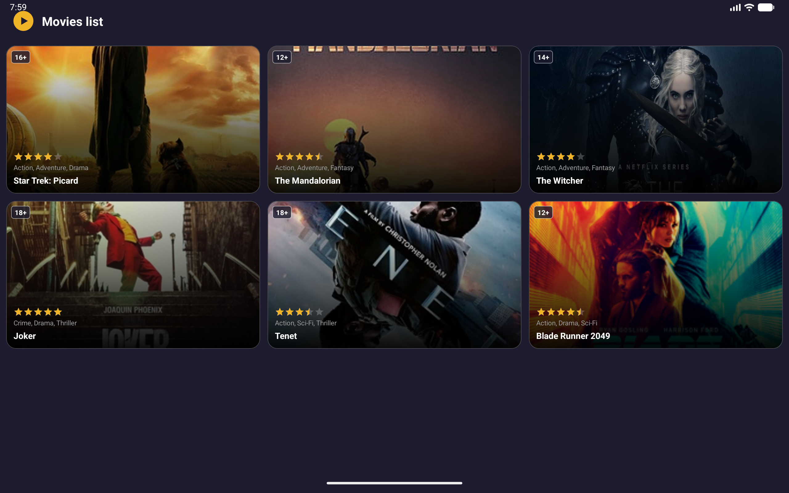
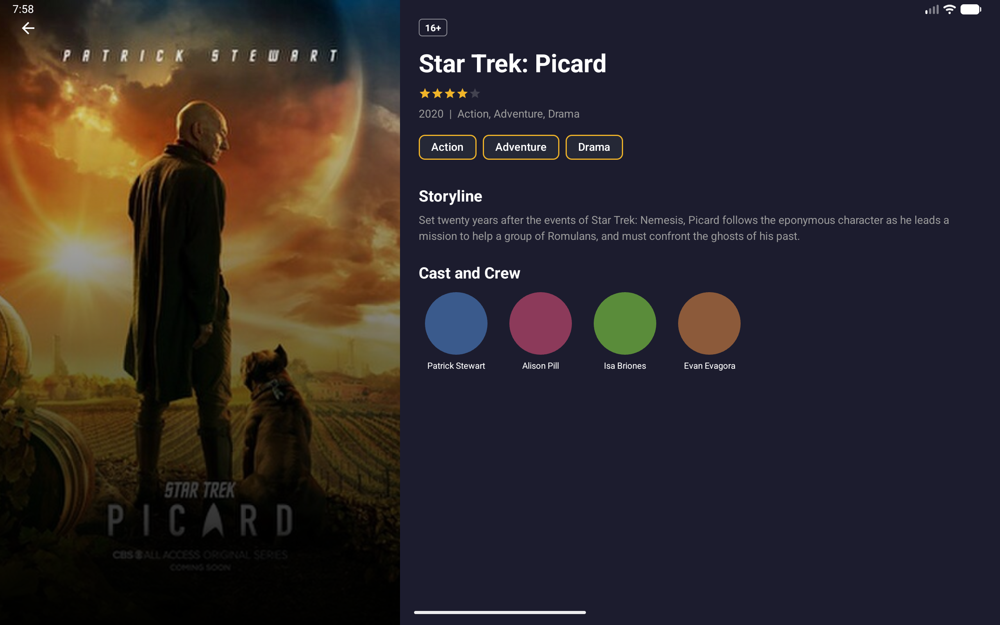

# KinoMaket

Android-приложение — каталог фильмов с тёмной темой. Учебный проект курса Product Star.

## Скриншоты

| Список фильмов (планшет) | Детальный экран (планшет) |
|---|---|
|  |  |

## Экраны

| Список фильмов | Детальный экран |
|---|---|
| Сетка карточек 2×N (3×N на планшете) | Hero-изображение, рейтинг, сюжет, актёры |

## Требования задания

- **Запрещено:** `ConstraintLayout`, `RecyclerView`
- **Обязательно:** часть виджетов добавлена программно из кода
- **Обязательно:** использование виджетов Material Design

## Реализация

### Layouts
- `LinearLayout` + `ScrollView` + `GridLayout` — список фильмов
- `ScrollView` + `FrameLayout` — детальный экран (портрет)
- Горизонтальный `LinearLayout` (two-pane) — детальный экран на планшете (`layout-sw600dp`)

### Программные виджеты
- **Карточки фильмов** в `MainActivity` — `MaterialCardView`, `FrameLayout`, `ImageView`, `RatingBar`, `TextView` — полностью из кода
- **Актёры** в `MovieDetailActivity` — `ShapeableImageView` + `MaterialTextView` — из кода
- **Чипы жанров** в `MovieDetailActivity` — `Chip` добавляются в `ChipGroup` из кода

### Material Design
- `MaterialCardView` — карточки фильмов
- `ShapeableImageView` — круглые фото актёров
- `Chip` / `ChipGroup` — теги жанров

### Адаптивность
| Экран | Колонок в списке | Детальный экран |
|---|---|---|
| Телефон | 2 | Вертикальный скролл |
| Планшет (≥600dp) | 3 | Two-pane (постер + контент) |

## Стек

- Kotlin
- Material Components 1.10.0 (Material 3)
- minSdk 24 / targetSdk 36
