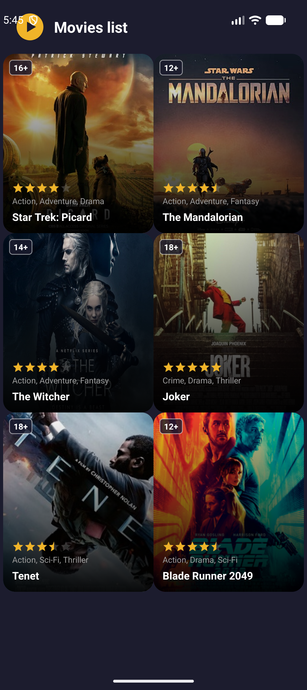
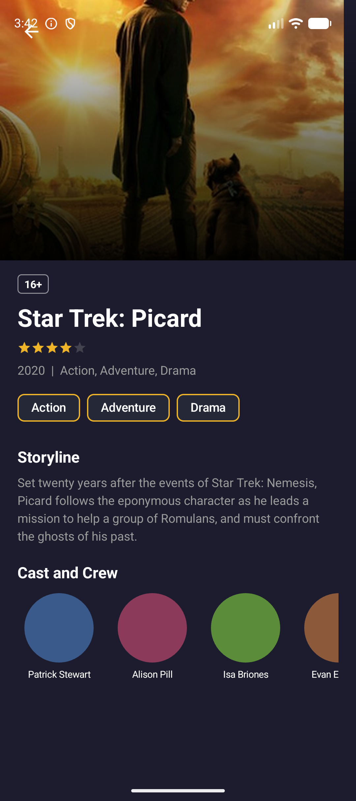
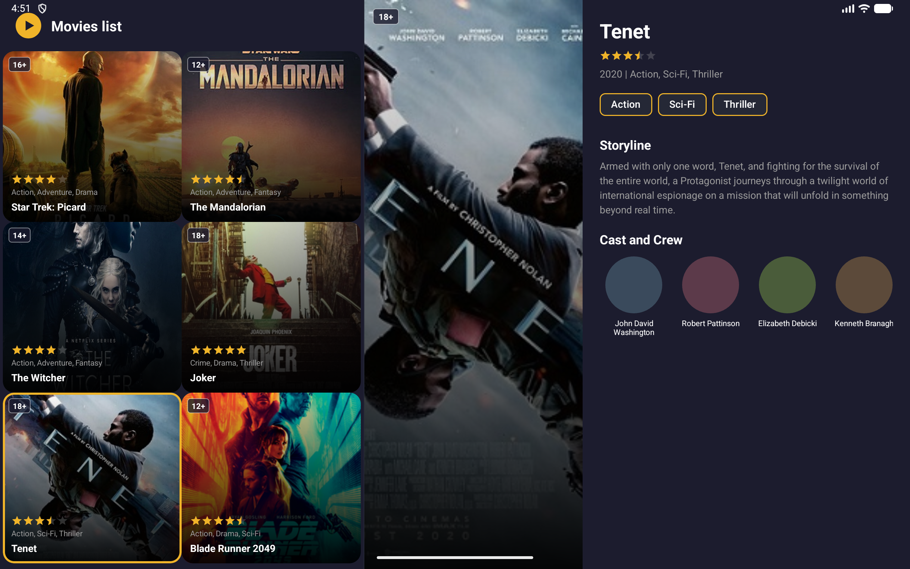

# KinoMaket

Android-приложение — каталог фильмов с тёмной темой. Учебный проект курса Product Star.

## Скриншоты

### Телефон
| Список фильмов | Детальный экран |
|---|---|
|  |  |

### Планшет — Master-Detail

**Landscape** — список слева, постер слева / текст справа:

**Portrait** — список слева (2 колонки), справа постер + текст снизу:

## Архитектура

Single Activity + Fragments, Navigation Component, ViewModel.

| Класс | Роль |
|---|---|
| `MainActivity` | Единственная Activity; реализует `MovieNavigator`; на планшете подписывается на `MoviesViewModel` |
| `MoviesViewModel` | Хранит `selectedMovieId: LiveData<Int>` — выбранный фильм на планшете |
| `MovieNavigator` | Интерфейс, через который фрагменты узнают режим (`isTwoPane`) без прямой зависимости на `MainActivity` |
| `MovieListFragment` | Список фильмов — `RecyclerView` + `GridLayoutManager` |
| `MovieDetailFragment` | Детализация фильма; получает `movieId` через аргумент `ARG_MOVIE_ID` |
| `MovieAdapter` | `ListAdapter<Movie>` + `DiffUtil` с ViewBinding; подсвечивает выбранную карточку в two-pane режиме |
| `Extensions.kt` | Общие расширения `Int.dp` / `Float.dp` для всего пакета |

## Навигация

- `nav_graph.xml` — граф с двумя destination-ами и action `action_list_to_detail`
- `NavHostFragment` + `FragmentContainerView` — контейнер на телефоне
- `NavController.navigate()` + `FragmentNavigatorExtras` — переход список → деталь на телефоне
- Back stack управляется NavController — восстанавливается при поворотах автоматически
- На планшете выбор фильма публикуется через `MoviesViewModel`, `MainActivity` заменяет фрагмент в правой панели

## Shared Element Transition

Постер из карточки списка плавно «превращается» в постер на экране детализации:

- `transitionName = "movie_poster_${movie.id}"` задаётся в адаптере и фрагменте детали
- `FragmentNavigatorExtras` передаёт shared view в NavController
- `postponeEnterTransition()` / `startPostponedEnterTransition()` синхронизируют анимацию
- На планшете переход не используется — настройка transition пропускается через `if (!isTwoPane)`

## Адаптивный Layout

| Экран | Список | Детализация |
|---|---|---|
| Телефон | 2 колонки, полный экран | Отдельный фрагмент в back stack |
| Планшет portrait (≥600dp) | 2 колонки, левая панель (40%) | Правая панель (60%): постер сверху, текст и актёры снизу |
| Планшет landscape (≥600dp) | 2 колонки, левая панель (40%) | Правая панель (60%): постер слева, текст и актёры справа |

Квалификаторы ресурсов:
- `layout/` — телефон (одна панель, NavHostFragment)
- `layout-sw600dp/` — планшет portrait (горизонтальный split, детали вертикальные)
- `layout-sw600dp-land/` — планшет landscape (горизонтальный split, детали горизонтальные)

При клике `MoviesViewModel.selectMovie()` обновляет деталь без NavController; выбранная карточка получает обводку цветом `colorPrimary`.

## Стек

- Kotlin
- Navigation Component 2.8.5
- ViewModel / LiveData (lifecycle)
- RecyclerView 1.3.2
- ViewBinding
- Material Components 1.10.0 (Material 3)
- minSdk 24 / targetSdk 36
