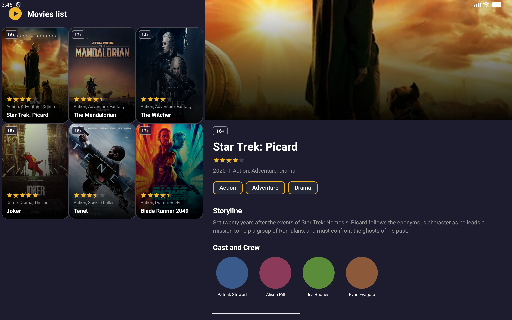

# KinoMaket

Android-приложение — каталог фильмов с тёмной темой. Учебный проект курса Product Star.

## Скриншоты

### Телефон
| Список фильмов | Детальный экран |
|---|---|
|  |  |

### Планшет — Master-Detail

## Архитектура

Single Activity + Fragments, Navigation Component.

| Класс | Роль |
|---|---|
| `MainActivity` | Единственная Activity, хост фрагментов |
| `MovieListFragment` | Список фильмов (RecyclerView + GridLayoutManager) |
| `MovieDetailFragment` | Детализация фильма |
| `MovieAdapter` | RecyclerView адаптер с ViewBinding |

## Навигация

- `nav_graph.xml` — граф навигации с двумя destination-ами и action
- `NavHostFragment` + `FragmentContainerView` — контейнер для фрагментов
- `NavController.navigate()` — переход список → деталь
- Back stack управляется NavController — восстанавливается при поворотах экрана автоматически

## Shared Element Transition

Постер из карточки списка плавно «превращается» в постер на экране детализации:

- `transitionName = "movie_poster_N"` задаётся в адаптере и фрагменте детали
- `FragmentNavigatorExtras` передаёт shared view в NavController
- `postponeEnterTransition()` / `startPostponedEnterTransition()` синхронизируют анимацию с загрузкой view

## Адаптивный Layout

| Экран | Список | Детализация |
|---|---|---|
| Телефон | 2 колонки, полный экран | Отдельный фрагмент (back stack) |
| Планшет (≥600dp) | 3 колонки, левая панель (40%) | Правая панель (60%), всегда видна |

На планшете используется `layout-sw600dp/activity_main.xml` с горизонтальным split-layout. При клике на фильм деталь обновляется в правой панели без навигации.

## Стек

- Kotlin
- Navigation Component 2.8.5
- RecyclerView 1.3.2
- ViewBinding
- Material Components 1.10.0 (Material 3)
- minSdk 24 / targetSdk 36
